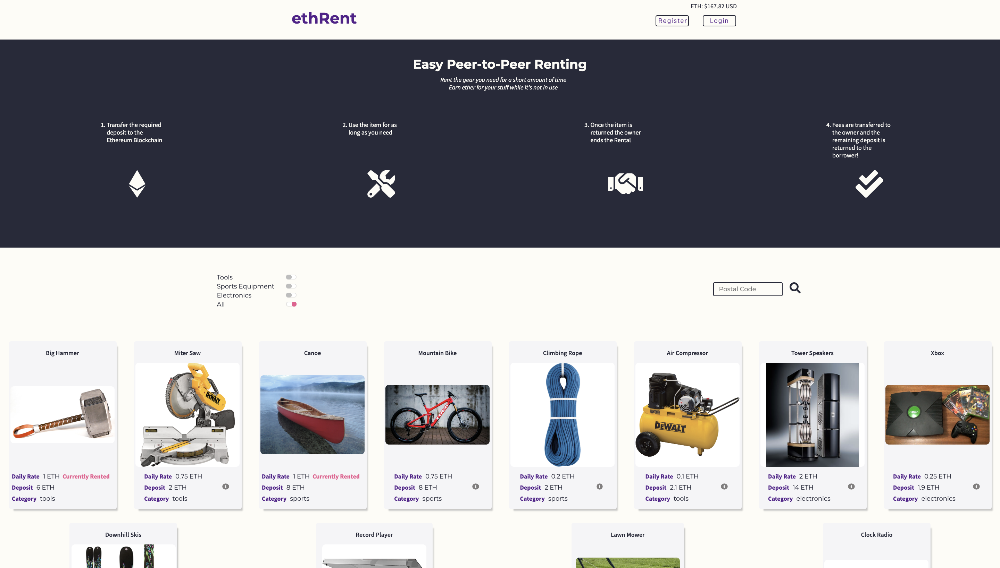
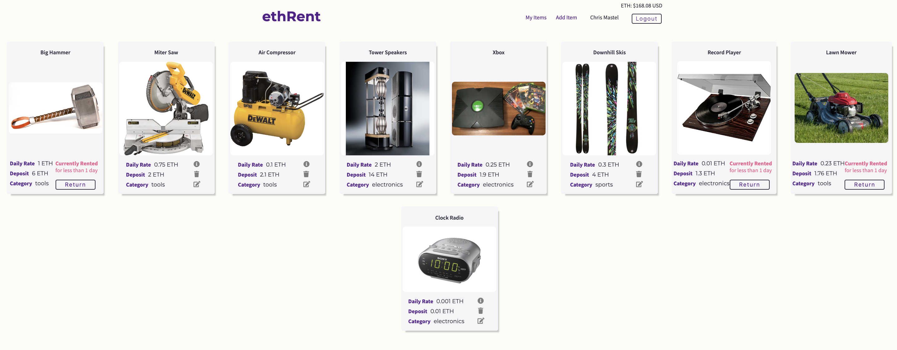
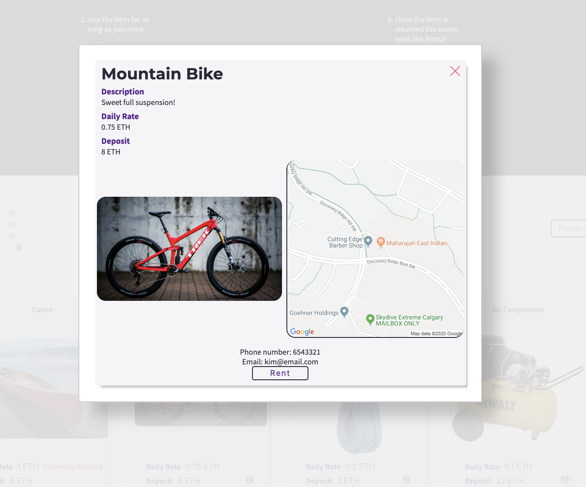
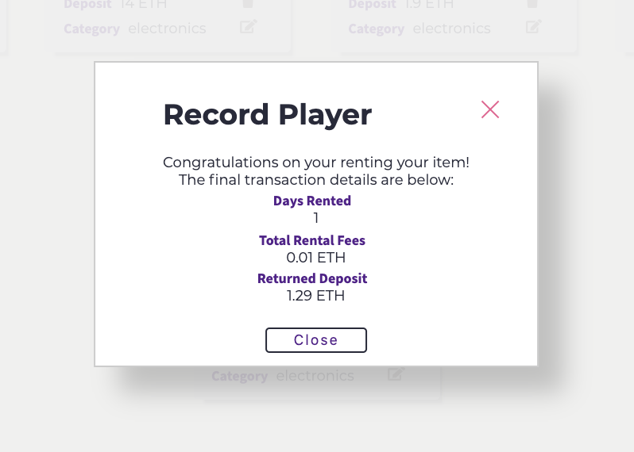

# ethRent Project

ethRent is a Peer-to-Peer Item Rental decentralized application based on the Ethereum blockchain. 

The overall intent of this application is to have a collection of items which are available for rent across a community. 

Instead of purchasing a new item when it is only needed for a short amount of time, or avoiding the hassle of dealing with distant rental stores, users will have the ability to rent what they need from within their own community. They will be able to do this in a trust-less environment where are transaction information, including the deposit, is stored on the Ethereurm blockchain.

For the owners of various items, this application will allow them to earn Ether for things which would otherwise be sitting idle.

## Final Product

Home page:

My Items page:

Item Detail:

Return Receipt:

## Purpose

**_BEWARE:_ This project was published for learning purposes. It is _not_ intended for use in production-grade software.**

This project was created and published by [Zhabskyi](https://github.com/Zhabskyi) and [cmastel](https://github.com/cmastel) as part of our learnings at Lighthouse Labs. 

## Key Features

* Users who wish to make an item available for rent must Register (this information is stored off the block chain)
* When a user is logged in, they are able to create an item
  * In addition to Title, Description and a Photo, the owner will specify a Daily Rental Rate and a Required Deposit (both in Ether)
* When someone is interested in borrowing an item, they can search by category or postal code
  * Postal code is a live search function, therefore the area gets progressively smaller as the full postal code is inputted
* Once the borrower finds an item they are interested in, they click on the Information button to see further details on the item, and a map showing the Postal Code area of where the owner is located
  * A button then allows the user to see the contact information for the owner so that they can make arrangements to pick up the item
  * Once they pick up the item, they click the Rent button
    * This initiates a smart contract which will transfer the required deposit from the users wallet (i.e. Meta Mask), which will be stored on the blockchain
* Once the item is returned, the owner clicks on the Return button
  * This triggers the completion of the rental
  * A notification shows the summary of the rental, including days rented, total fees earned, and the amount of deposit returned to the borrower
* A logged in owner is able to view My Items which shows a summary of their created items, as well as Edit and Delete any of their items which are not being rented at the time

## Potential Future Additions

Over time, the following additional features would improve the ethRent app:
* Have in-app, secure, communication between a potential borrower and the owner
* Add web sockets so that state can be updated for all users when it is changed for one user
* Have the location search based on distance, rather than a progressively defined postal code
* Allow the owner to add "damages" to the rental fees they collect if the item is returned in the same state as when it was rented
* If the user does not have a browser which supports an Ethereum client (i.e. Meta-Mask), show a screen outlining the instructions to install one and obtain their initial Ether
* Link to an Ether provider (i.e. [Shakepay](https://shakepay.co) in order for a user to get more Ether when needed

## Getting Started

1. Fork this repository, then clone your fork of this repository.
2. cd into the Client folder and install Client dependencies using the `npm install` command.
  * Refer to [Client README.md](/client/README.md) for additional instructions
3. cd into the Server folder and install Server dependencies using the `npm install` command.
  * Refer to [Server README.md](/server/README.md) for additional instructions
4. Install [Ganache](https://www.trufflesuite.com/ganache) as a local blockchain (for development purposes)
  * Connect the Ganache server to Meta-Mask
3. cd to the main folder, start the web server using the `npm start` command. The app will be served at <http://localhost:3002/>.
4. Go to <http://localhost:3002/> in your browser.

## Client Dependencies

- Font Awesome
- Axios
- Chai
- Chai-as-promised
- Chai-BigNumber
- Classnames
- Node-sass
- React
- Web3

## Server Dependencies

- AWS-SDK
- Bcrypt
- Body-parser
- Cors
- Dotenv
- Express
- Helmet
- jsonWebToken
- Multer
- pg
- Socket.io
- ws

